# RESTAURANT-DATABASE-MANAGEMENT-SYSTEM
DAO pattern, Java, PostgreSQL

##### How to set up the project to make it run by me
- First on terminal, command these lines
- `sudo -u postgres psql` to enter the postgresql shell
- `CREATE DATABASE restaurant_db;` to create the database
- `\c restaurant_db` to connect to the database

- And then go to intellij and do the following

- Set up the driver(jar file) for the postgresql

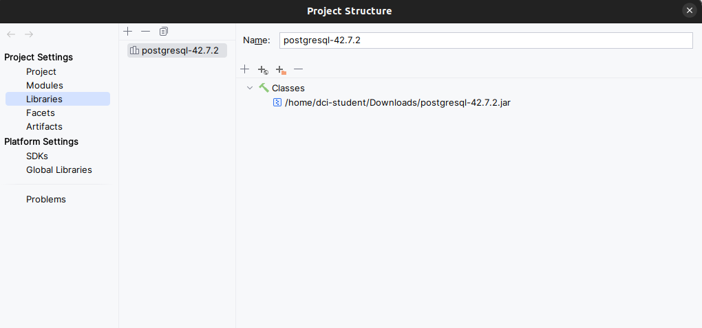

- Choose postgresql, and enter the database name, user, password

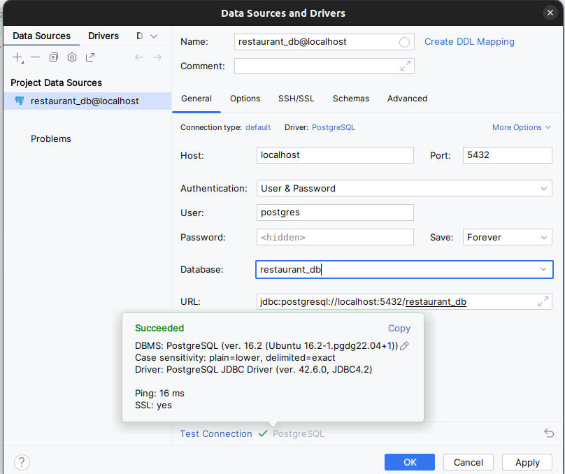

- Create 2 tables for the database

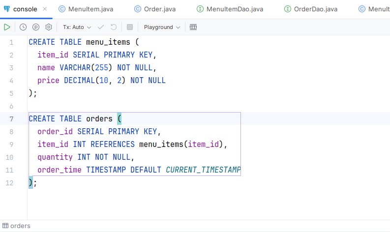


### Run the application

- Run the main class(in the console, you can see the output)

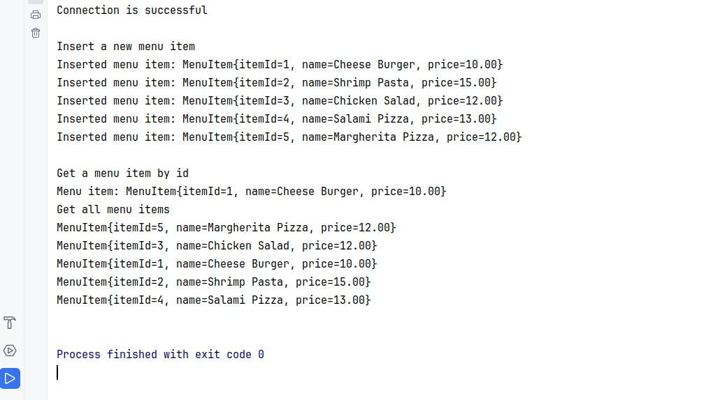

- On Sql shell, you can see the database is updated

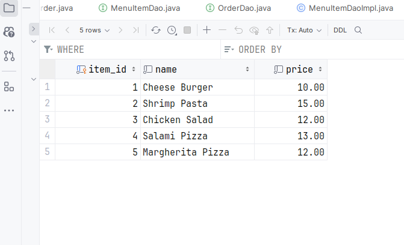

- Sequence of the database

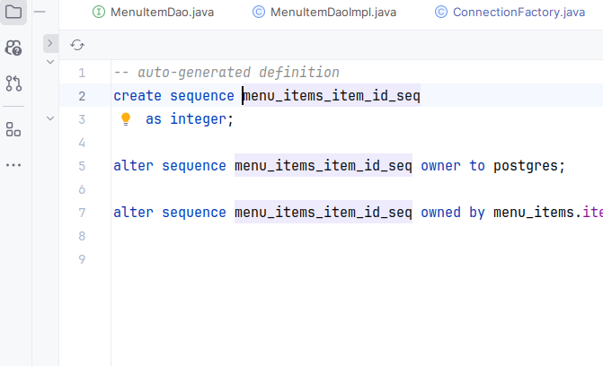

- The database is updated in Main class(in console, you can see the output)

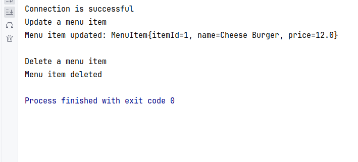

- The database is updated on SQL shell menu items

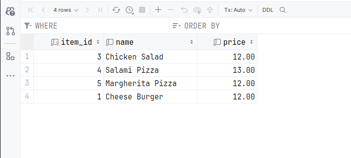

- The database is updated on SQL shell orders (later on)

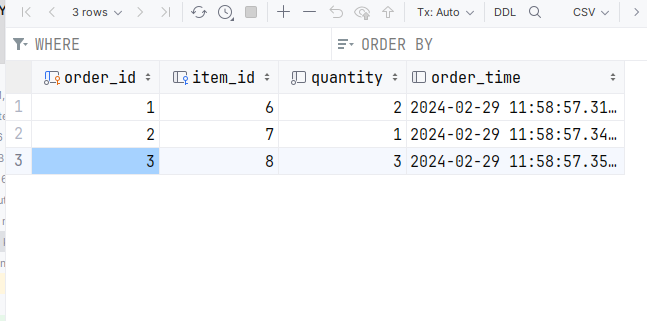

-Test method for MenuItemDaoImpl class

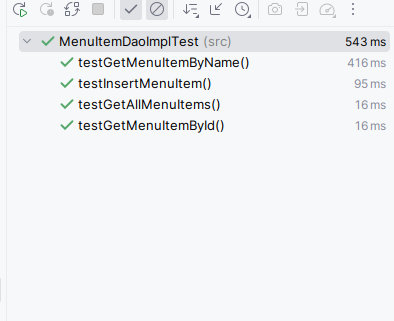

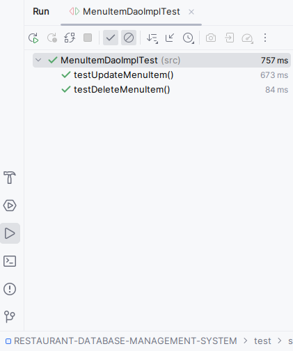


-Test method for OrderDaoImpl class

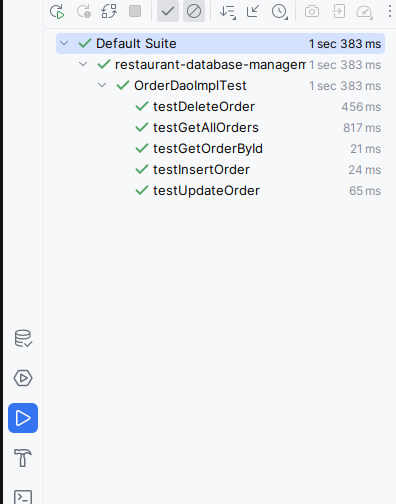


Finish

----------------------------------------------------------------------------------------------------------------------------


# Assignment: Restaurant Database Management System

## Background

In the bustling world of culinary delights, a well-organized database is the backbone of any successful restaurant. It not only helps in keeping track of the inventory but also aids in managing orders efficiently. In this assignment, you will develop a simple Java application that interacts with a PostgreSQL database to manage a restaurant's database with two main entities: `MenuItems` and `Orders`.

## Objective

The primary objective of this assignment is to create a Java application that can perform CRUD (Create, Read, Update, Delete) operations on two tables in a PostgreSQL database: `MenuItems` and `Orders`. This application will help the restaurant manage its menu and orders effectively.

## Requirements

- **Java Development Kit (JDK)**: Ensure you have JDK installed on your system to compile and run Java applications.
- **PostgreSQL**: You'll need PostgreSQL installed and running on your system. Create a database named `restaurant_db` for this assignment.
- **IDE**: Any Integrated Development Environment (IDE) like IntelliJ IDEA, Eclipse, or Visual Studio Code for writing and running your Java code.
- **JDBC**: Java Database Connectivity (JDBC) driver for PostgreSQL to enable database operations from Java code.

## Step-by-Step Guidance

### Step 1: Database Setup

#### 1.1 Create Tables

Execute the following SQL scripts to create `menu_items` and `orders` tables in your `restaurant_db`.

```sql
CREATE TABLE menu_items (
    id SERIAL PRIMARY KEY,
    name VARCHAR(255) NOT NULL,
    price DECIMAL(10, 2) NOT NULL
);

CREATE TABLE orders (
    id SERIAL PRIMARY KEY,
    item_id INT,
    quantity INT NOT NULL,
    order_time TIMESTAMP DEFAULT CURRENT_TIMESTAMP,
    FOREIGN KEY (item_id) REFERENCES menu_items(id)
);
```

### Step 2: Model Classes

#### 2.1 MenuItem Model

Create a Java class named `MenuItem` with fields `id`, `name`, and `price`. Include constructors, getters, and setters.

#### 2.2 Order Model

Create a Java class named `Order` with fields `id`, `itemId`, `quantity`, and `orderTime`. Include constructors, getters, and setters.

### Step 3: DAO Interfaces

#### 3.1 MenuItemDao Interface

Define an interface `MenuItemDao` with methods for CRUD operations on `menu_items`.

#### 3.2 OrderDao Interface

Define an interface `OrderDao` with methods for CRUD operations on `orders`.

### Step 4: DAO Implementations

Implement the `MenuItemDao` and `OrderDao` interfaces in classes named `MenuItemDaoImpl` and `OrderDaoImpl`, respectively. Use JDBC to interact with the PostgreSQL database.

### Step 5: ConnectionFactory Class

Create a `ConnectionFactory` class to manage database connections. Use the JDBC URL, username, and password to connect to `restaurant_db`.

### Step 6: Main Class

Develop a `Main` class to demonstrate the usage of `MenuItemDao` and `OrderDao`. Perform operations like adding new menu items, placing orders, updating menu items, listing all orders, etc.

### Step 7: Testing

Test your application thoroughly. Ensure that all CRUD operations work as expected for both `menu_items` and `orders`.

## Submission Guidelines

- Submit the source code files for all classes (`MenuItem`, `Order`, `MenuItemDao`, `OrderDao`, `MenuItemDaoImpl`, `OrderDaoImpl`, `ConnectionFactory`, and `Main`).
- Include a README file with instructions on how to set up and run your application.
- Ensure your code is well-commented and follows Java coding standards.

This assignment will help you understand how to interact with databases using JDBC in a Java application. It will also give you practical experience in managing relational data within a software application.


